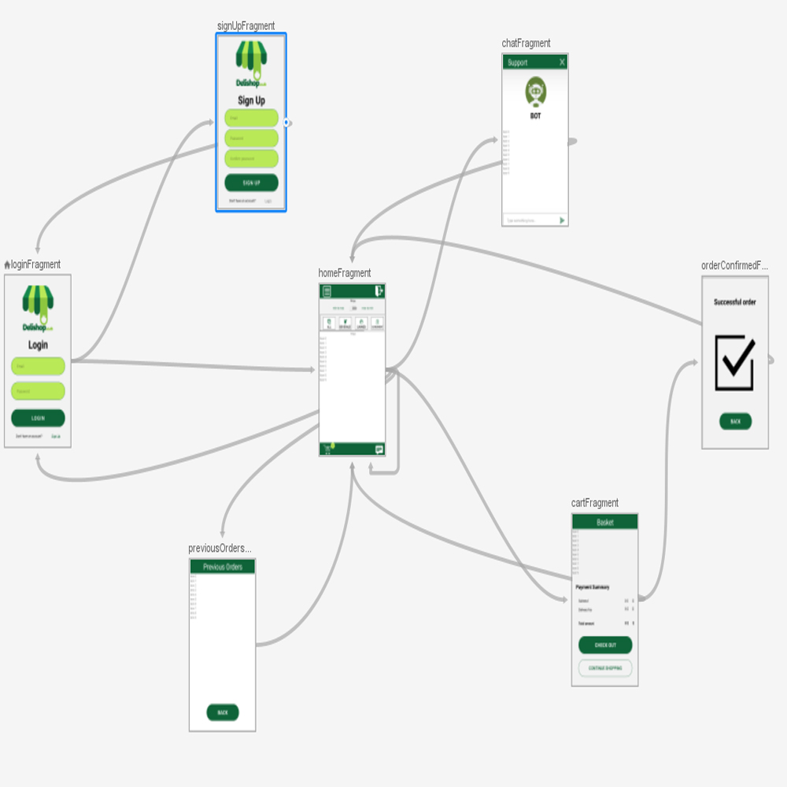
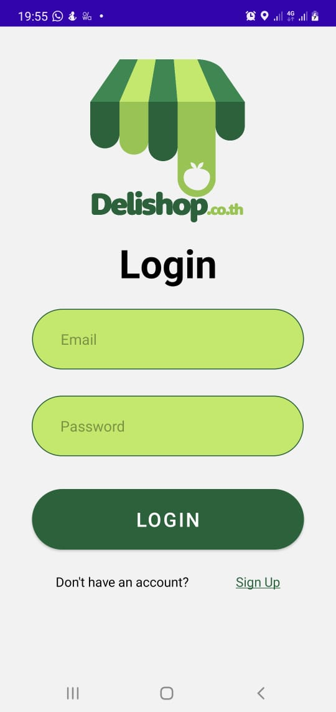
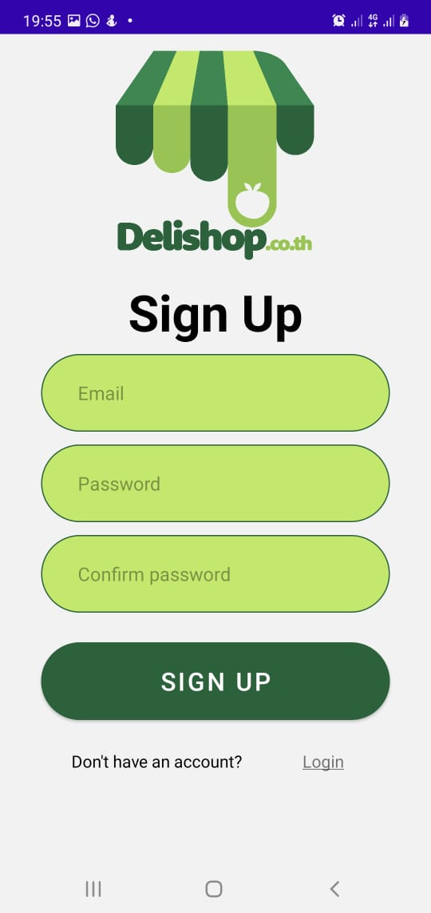
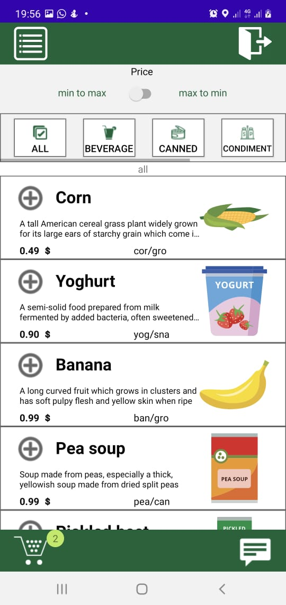
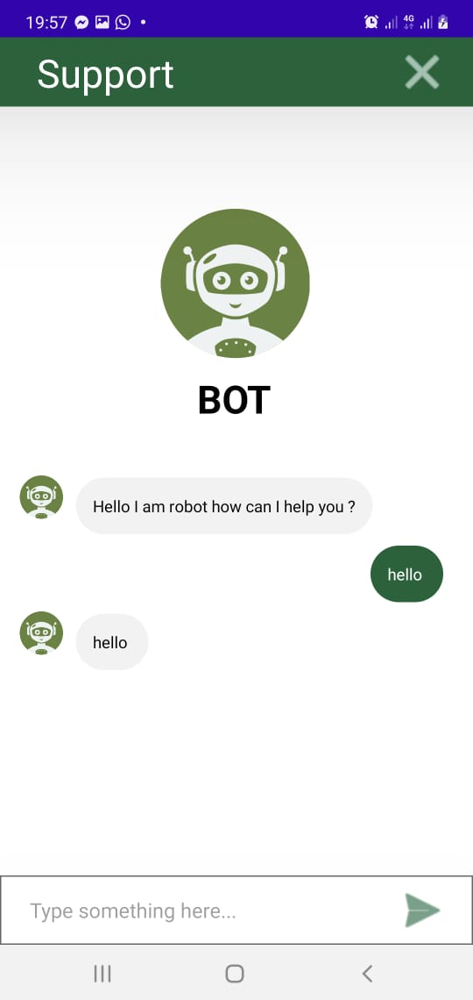
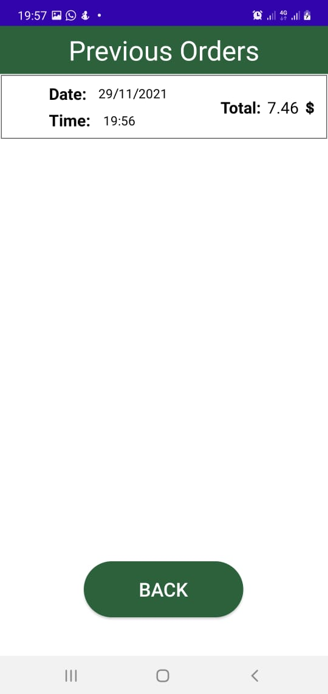
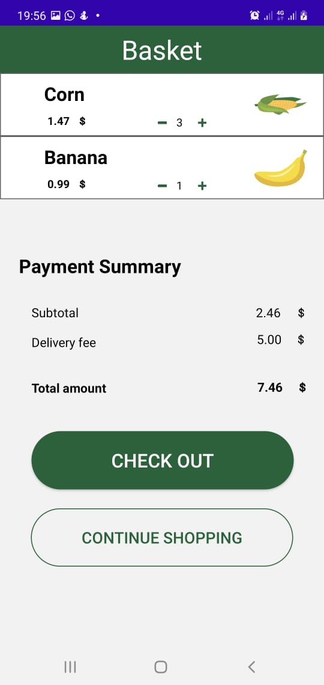
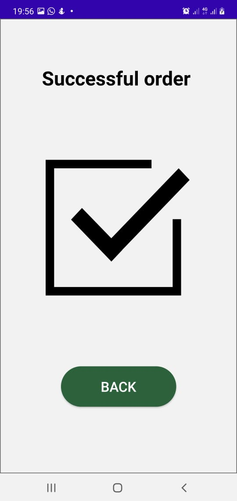

# Project Idea

The idea of this project is to make a grocery android app that users can use to order the groceries they want. It doesn't contain any backend it is only android front end, but it will contain login athentication with firebase.

# Extensions
I have created a stupid chatbot screen that replies with the same sentence entered.
I have also created a screen to preview the previous orders total and date

# Navigation
application contain 7 screens here is the navigation graph for them.

## screens
my app consists of 7 main screens

### Sign In screen
enables the user to sign in using email and password or move to sign up screen.

### Sign Up screen
enables the user to sign up using his email and password or move to sign in screen.

### Home screen
enables the user to move to chatbot screen or sign out or to mover to cart or preview his previous orders. User can add items to his cart and can edit their quantity inside the cart screen. User can filter the items based on the price from low to high or the type of  Cart in the left bottom illustrate the number of different items in his cart

### Chat Bot screen
stupid chatbot that replies with the same text you enter

### Previous Orders screen
enables the user to preview his previous orders

### Cart screen
enable the user to check out or edit quantities of items or back to home to continue shopping

### Confirm Order screen
just to inform the user that his order is done.

